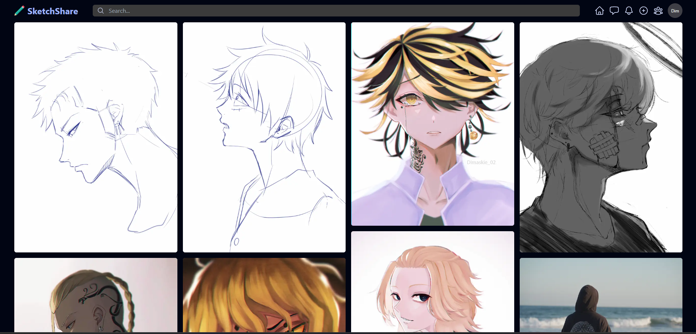
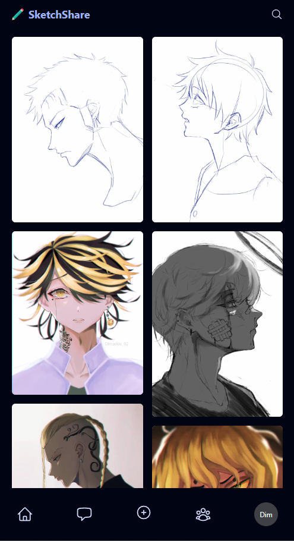

<h1 align="center">
  SkecthShare<br/>
  <a href="https://sketchshare.vercel.app/" target="_blank">sketchshare.vercel.app</a>
</h1><br/>
<p align="center">
   
        
</p>


<!-- START doctoc generated TOC please keep comment here to allow auto update -->
<!-- DON'T EDIT THIS SECTION, INSTEAD RE-RUN doctoc TO UPDATE -->

<!-- END doctoc generated TOC please keep comment here to allow auto update -->

## Introduction

SketchShare is a vibrant online community where users can share images, add descriptions, and interact with other users' posts. The platform allows users to create accounts and log in to personalize their experience.
<!--
<p align="center">
  
 </p> -->

## Features

A few of the things you can do with GitPoint:

* User Registration and Login
* Image Upload
* Explore and Discover
* Dark Mode
* Web responsive

 <!--<p align="center">
  
</p>

<p align="center">
  </p>
 -->
 
    
## Build Process
* This is a [Next.js](https://nextjs.org/) project bootstrapped with [`create-next-app`](https://github.com/vercel/next.js/tree/canary/packages/create-next-app).

First, run the development server:

```bash
npm run dev
# or
yarn dev
# or
pnpm dev
# or
bun dev
```

Open [http://localhost:3000](http://localhost:3000) with your browser to see the result.


<!--


## Feedback

Feel free to send us feedback on [Twitter](https://twitter.com/gitpointapp) or [file an issue](https://github.com/gitpoint/git-point/issues/new). Feature requests are always welcome. If you wish to contribute, please take a quick look at the [guidelines](./CONTRIBUTING.md)!

If there's anything you'd like to chat about, please feel free to join our [Gitter chat](https://gitter.im/git-point)!

## Contributors

This project follows the [all-contributors](https://github.com/kentcdodds/all-contributors) specification and is brought to you by these [awesome contributors](./CONTRIBUTORS.md).

## Build Process

- Follow the [React Native Guide](https://facebook.github.io/react-native/docs/getting-started.html) for getting started building a project with native code. **A Mac is required if you wish to develop for iOS.**
- Clone or download the repo
- `yarn` to install dependencies
- `yarn run link` to link react-native dependencies
- `yarn start:ios` to start the packager and run the app in the iOS simulator (`yarn start:ios:logger` will boot the application with [redux-logger](<https://github.com/evgenyrodionov/redux-logger>))
- `yarn start:android` to start the packager and run the app in the the Android device/emulator (`yarn start:android:logger` will boot the application with [redux-logger](https://github.com/evgenyrodionov/redux-logger))

Please take a look at the [contributing guidelines](./CONTRIBUTING.md) for a detailed process on how to build your application as well as troubleshooting information.

**Development Keys**: The `CLIENT_ID` and `CLIENT_SECRET` in `api/index.js` are for development purposes and do not represent the actual application keys. Feel free to use them or use a new set of keys by creating an [OAuth application](https://github.com/settings/applications/new) of your own. Set the "Authorization callback URL" to `gitpoint://welcome`.

 </p> -->
